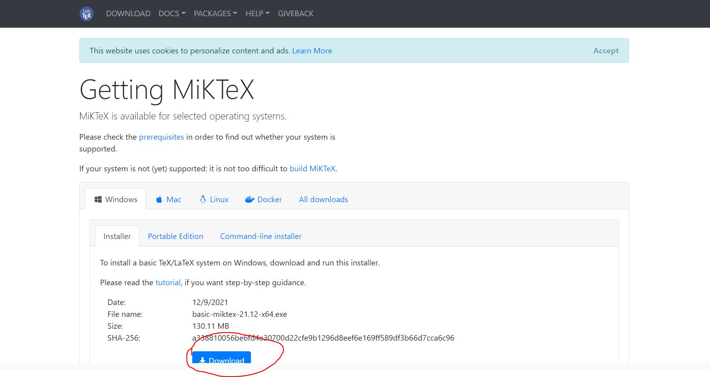
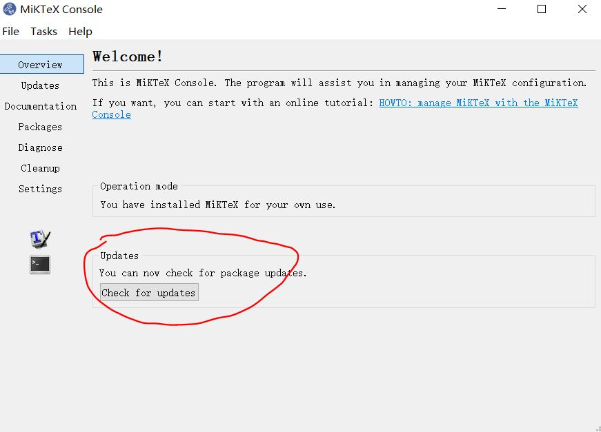
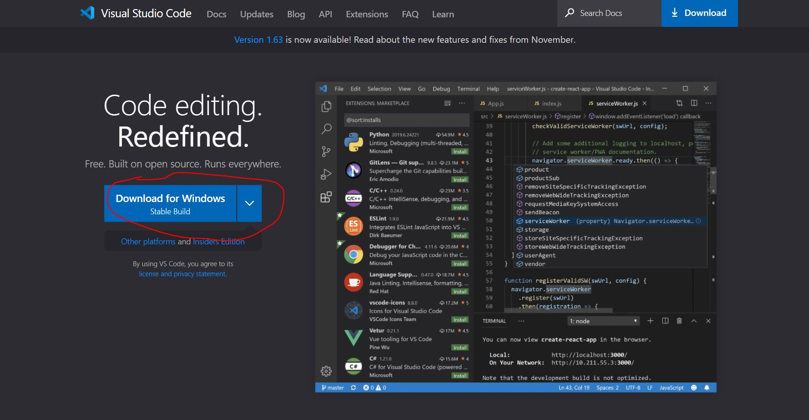
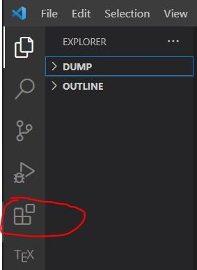
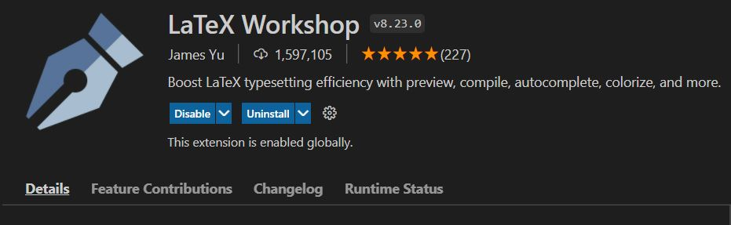
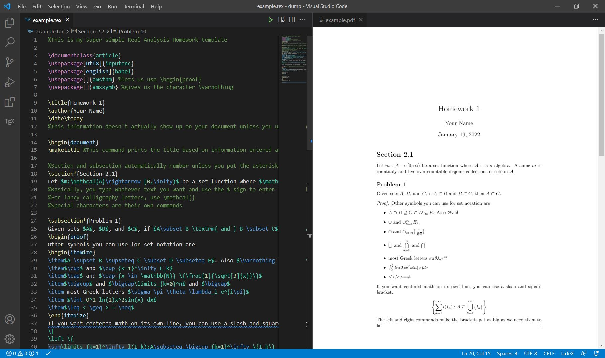

# LaTeX setup for VS Code

## LeTeX distribution setup 
- Download and Install [MiKTeX](https://miktex.org/download/)

  
  
- Open MikTeX Console and check for updates

  
  

## VS Code setup
- Download Visual Studio Code from [the official website](https://code.visualstudio.com/)

  
  
- Open VSCode. Click extension, search for "LaTeX Workshop"

  
  
- Install the extension. 

  
  
- Now you can create .tex file and write LaTeX documents!

  
