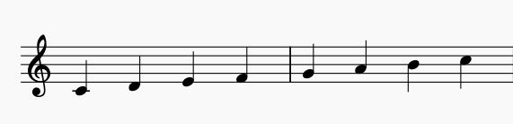
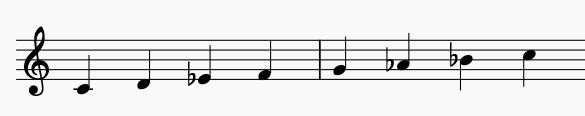

# Modes in music
  Mode is a set of musical notes (scales) in music composition and anaylsis. Compared to scales, modes emphasize on harmonic features. It can be understood as an extensive form of chords. 
## Major and Minor
  The most classic examples are the Ionian modes (major) and Aeolian modes (minor). 
  Ionian contains tonic, major second, major third, perfect fourth, perfect fifth, major sixth, major seventh. In C Ionian, the notes are C D E F G A B.
  
  
  
  Aeolian contains tonic, major second, minor third, perfect fourth, perfect fifth, minor sixth, minor seventh. In C Aeolian, the notes are C D Eb F G Ab Bb.
  
  
  
  Note that the notes in A Aeolian are A B C D E F G, which is the same as C Ionian. Aeolian mode is the tranposition of the correponding Ionian mode. In fact, due to the asymmetric nature, there are seven different tranpositions of C Ionian: D Dorian, E Phygian, F lydian, G Mixolydian, A Aeolian, B Locrian. They are usually named as church modes or Gregorian modes. 
## Phygian Dominant
